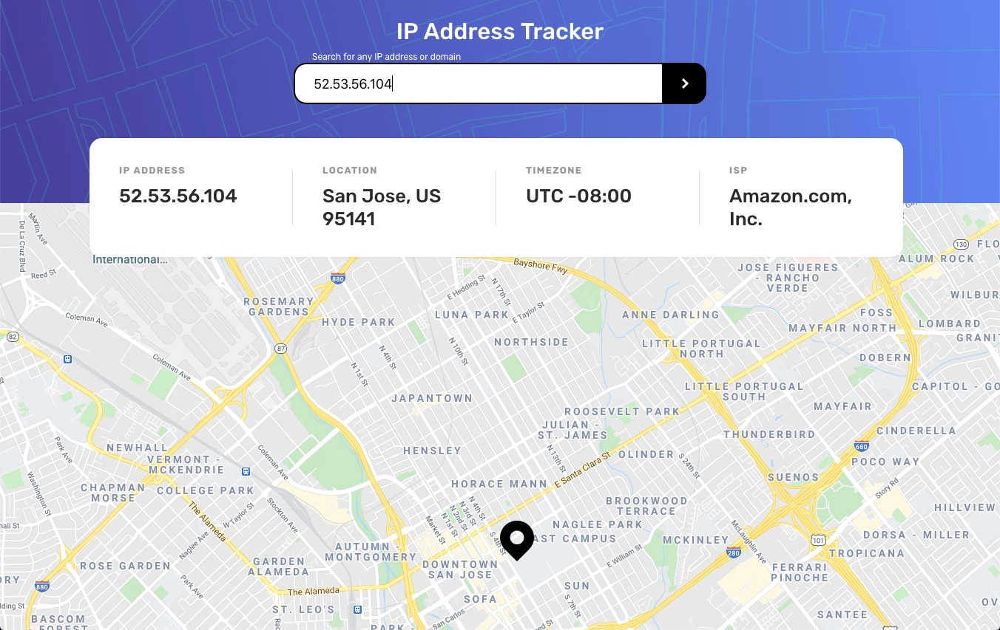

# Frontend Mentor - IP Address Tracker

## Welcome! 👋

This project uses a geolocation API called [https://geoiplookup.io/](GeoIPLookup.io) to find key information plus latitude and longitude coordinates which is then used to show the location using Google Maps API.

This was a fun project to make and great for refreshing on React.js. 

This project was bootstrapped with [Create React App](https://github.com/facebook/create-react-app).

## To run on your local machine:

1. Create a ".env" file in the root directory with the following line of text:
`REACT_APP_GOOGLE_API_KEY=[Google maps API Key]`
Replace `[Google maps API Key]` with your own Google Maps API Key

2. Install project dependencies:
`npm install`

3. The following scripts are available to run:

### `yarn start` or `npm start`

Runs the app in the development mode. 
Open [http://localhost:3000](http://localhost:3000) to view it in the browser.

The page will reload if you make edits. 
You will also see any lint errors in the console.

### `yarn test` or `npm test`

Launches the test runner in the interactive watch mode. 
See the section about [running tests](https://facebook.github.io/create-react-app/docs/running-tests) for more information.

### `yarn build` or `npm build`

Builds the app for production to the `build` folder. 
It correctly bundles React in production mode and optimizes the build for the best performance.

The build is minified and the filenames include the hashes. 
Your app is ready to be deployed!

See the section about [deployment](https://facebook.github.io/create-react-app/docs/deployment) for more information.

### `yarn eject` or `npm eject`
